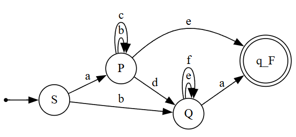

# Topic: Intro to formal languages. Regular grammars. Finite Automata.
****
### Course: Formal Languages & Finite Automata
### Author: Maxim Alexei
----

## Theory:
****
##### Formal Languages Overview
A **formal language** is a structured system of communication defined by precise mathematical rules. It comprises three core components [[3]](#ref3):
- **Alphabet ($\Sigma$):** A finite, non-empty set of symbols (e.g., binary alphabet $\Sigma=$ {0, 1})
- **Vocabulary:** A set of valid words formed from the *alphabet*
- **Grammar:** A set of rules that dictate how valid *strings* are constructed from the *alphabet*
##### Alphabet and Strings
- **Alphabet ($\Sigma$)** - a finite set of symbols
- **String/Word** - a finite sequence of symbols from an *alphabet*. For example, *0011* is a string over $\Sigma=$ {0, 1}
- **Empty String ($\varepsilon$ OR $\lambda$)** - a *string* with zero symbols
- **Length ($|w|$)** - the number of symbols in a *string* (e.g., $|0101| = 4$)
- **$\Sigma^*$ (Kleene Star)** - the set of all possible *strings* over $\Sigma$, including $\varepsilon$
- **$\Sigma^+$** = $\Sigma^*$/{ $\varepsilon$ }, the set of all possible *non-empty strings* over $\Sigma$ 
##### Operations on Strings
- **Concatenation** - combining two strings $x$ and $y$ to form $xy$, *non-commutative*
- **Power Notation** - repeating a string $n$ times (e.g., $a^3 = aaa$)  
##### Languages
A **language** $L$ is any subset of  $Σ^*$.
Some Operations on Languages:
- **Union:** $L_1 \cup L_2 = \{U \in \Sigma^* \mid U \in L_1 \text{ or } U \in L_2\}$
- **Intersection:** $L_1 \cap L_2 = \{U \in \Sigma^* \mid U \in L_1 \text{ and } U \in L_2\}$
- **Concatenation:** $L_1 L_2 = \{UV \mid U \in L_1, V \in L_2\}$
- **Kleene Star:** $L^* = \bigcup\limits_{i=0}^{\infty} L^{i}$  
##### Grammars
A **grammar** $G$ is a 4-tuple $G=(V_N, V_T, P, S)$:
- $V_N$: Non-terminal symbols (e.g., variables like $S, A$)
- $V_T$: Terminal symbols (*alphabet* $\Sigma$)
- $P$: Production rules (e.g., $S \rightarrow aS$)
- $S$: Start symbol. 
##### Chomsky Hierarchy
*Grammars* are classified into *four types* according to **Chomsky**:  
1. **Type 0 (Unrestricted):** No restrictions on production rules
2. **Type 1 (Context-Sensitive):** Rules of the form  $\alpha A \beta \rightarrow \alpha \gamma \beta$.  
3. **Type 2 (Context-Free):** Rules $A \rightarrow \gamma, \text{where } A \in V_N$.  
4. **Type 3 (Regular):** Rules  $A \rightarrow aB$ (right-linear) or $A \rightarrow Ba$ (left-linear),  $A \rightarrow a$.  
##### Regular Grammars and Finite Automata
- **Regular Grammars** generate regular languages, which can also be recognized by **finite automata**[[4]](#ref4).  
- **Finite Automaton (FA):** A 5-tuple $(Q, \Sigma, \delta, q_0, F)$:  
  - ( $Q$ ): Finite set of states.  
  - ( $\delta$ ): Transition function $( Q \times Σ \rightarrow Q )$.  
  - ( $q_0$ ): Initial state.  
  - ( $F$ ): Accepting states.  
  
## Objectives:
****
1. Discover what a language is and what it needs to have in order to be considered a formal one.
2. Provide the initial setup for the evolving project that you will work on during this semester. You can deal with each laboratory work as a separate task or project to demonstrate your understanding of the given themes, but you also can deal with labs as stages of making your own big solution, your own project. Do the following:
   	- Create GitHub repository to deal with storing and updating your project;
   - Choose a programming language. Pick one that will be easiest for dealing with your tasks, you need to learn how to solve the problem itself, not everything around the problem (like setting up the project, launching it correctly and etc.);
	- Store reports separately in a way to make verification of your work simpler;
4. According to your variant number, get the grammar definition and do the following:
   - Implement a type/class for your grammar;
	- Add one function that would generate 5 valid strings from the language expressed by your given grammar;
	- Implement some functionality that would convert an object of type Grammar to one of type Finite Automaton;
  	- For the Finite Automaton, please add a method that checks if an input string can be obtained via the state transition from it;


## Implementation description
****

* To begin with, in `Program.cs` where the `Main()` resides, I have initiated the grammar, by passing in the required values, according to my variant, number one. As we can see from the snippet of code I have used `HashSet<T>` in order to define the set of non-terminal and terminal symbols, as it's an unordered collection with unique elements, so it has a better performance than a `List<T>`, especially when used later on in the logic. As for the production rules, they have been represented as a `Dictionary<TKey,TValue>`, where as a key we have a the non-terminal symbol that can be replaced by either of the available elements from the List of strings that is paired to. Also, in order to visualize the definitions at runtime, I have overridden the `ToString()` method, in both `Grammar` and `FiniteAutomaton` for a clear view.

```csharp
// Variant 1 - Alexei Maxim
Console.WriteLine("Alexei Maxim,\nFAF-232,\nVariant 1\n");

// My variant's grammar definition
HashSet<string> vN = new HashSet<string>() {"S", "P", "Q"};
HashSet<char> vT = new HashSet<char>() {'a', 'b', 'c', 'd', 'e', 'f'};
Dictionary<string, List<string>> p = new Dictionary<string, List<string>>()
	{
		{"S", new List<string>() {"aP", "bQ"}},
		{"P", new List<string>() {"bP", "cP", "dQ", "e"}},
		{"Q", new List<string>() {"eQ", "fQ", "a"}}
	};
string s = "S";

// Initializing the grammar & finiteAutomaton
Grammar grammar = new Grammar(vN, vT, p, s);
FiniteAutomaton finiteAutomaton = grammar.ToFiniteAutomaton();

Console.WriteLine("My Variant's Grammar definition:");
Console.WriteLine(grammar.ToString());
```

* Later on, still in `Program.cs`, I call the `GenerateString()` method, five times by iterating, provided by the `Grammar`'s initialization, that generates five random strings based on the defined production rules, and at the same time it checks those *words* if they can be obtained via the state transition from the FA.

```csharp
for(int i = 0; i < 5; i++)
{
	string generatedString = grammar.GenerateString();
	Console.WriteLine("\n#{0} Generated string: {1}\nAccepted by automaton: {2}", i + 1, generatedString, finiteAutomaton.StringBelongToLanguage(generatedString));
}
```

- Next, the inner logic of the `Grammar` class should be analyzed. Obviously, it has some defined fields, as they are needed in order to have an actual definition of it, but we should focus more on the written methods within the class.  
- In this snippet of code, we have a method that generates words by following the `Grammar`'s production rules. The algorithm starts by defining a `StringBuilder` dynamic object, that later on gets converted to string, the reason of choosing this, instead of an actual `String` variable, is because a `String` object is immutable, so changing an initial string will create a new string object on the memory heap, instead of modifying an original string at the same memory address, just as `StringBuilder` allows.
- That `StringBulder` object, `current`, starts with the value of the *start symbol*, then in a while loop, we get into a for-loop to iterate through each symbol of `current`, checking if it's a non-terminal one. If true we access the values in the dictionary at the key that is the non-terminal symbol we are on, and we randomly pick a production rule and replace the symbol with it. Once the non-terminal symbol was replaced, we break from the for-loop and repeat the process until there are no non-terminal symbols in `current`, returning it as a string in the end.

```csharp
public string GenerateString()
{
	StringBuilder current = new StringBuilder(S);
	Console.Write("\nWord Build: {0}", current);
	while(true)
	{
		bool hasNonTerminal = false;

		for(int i = 0; i < current.Length; i++)
		{
			string symbol = current[i].ToString();
			if(VN.Contains(symbol))
			{
				hasNonTerminal = true;
				var productionRule = P[symbol];
				string usedReplacement = productionRule[RandomNumberGenerator.GetInt32(productionRule.Count)];
				current.Remove(i, symbol.Length);
				current.Insert(i, usedReplacement);

				Console.Write(" ---> {0}", current);

				break;
			}
		}
		if(!hasNonTerminal) break;
	}
	return current.ToString();
}
```

- Further on, we are going to have a look at the method that is used to instantiate a Finite Automaton based on the defined regular grammar. At the beginning of the method we can see the assignment of variables defined by the definition of a FA using the values from the ones given by the current Regular `Grammar`, such as `Q = V_N`, etc. However, a considerable part of the method is used to convert the production rules of the `Grammar`, defined using `Dictionary<string, List<string>>`, to the transition functions of the FA, which are represented via `Dictionary<(string, char), HashSet<string>>`, where we have as a key a tuple, composed of a state with the input symbol, that gets mapped to a set of states, that are the represented as the values of the key. In the end, a new `FiniteAutomaton` gets returned. 

```csharp
public FiniteAutomaton ToFiniteAutomaton()
{
	string qF = "q_F";
	HashSet<string> q = [.. VN, qF];
	HashSet<char> sigma = [.. VT];
	string q0 = S;
	Dictionary<(string, char), HashSet<string>> delta = new Dictionary<(string, char), HashSet<string>>();

	foreach(var rule in P)
	{
		foreach(var product in rule.Value)
		{
			string nonTerminal = string.Empty;
			char terminal = '\0';

			char[] productSymbols = product.ToArray();
			foreach(var symbol in productSymbols)
			{
				string symbolS = Convert.ToString(symbol);
				if(VN.Contains(symbolS))
				{
					nonTerminal = symbolS;
					continue;
				}
				terminal = symbol;
			}

			(string, char) key = (rule.Key, terminal);

			if(!delta.ContainsKey(key)) delta[key] = new HashSet<string>();

			delta[key].Add((nonTerminal == string.Empty)? qF:nonTerminal);
		}
	}

	return new FiniteAutomaton(q, sigma, delta, q0, qF);
}
```

- In continuity, we are going to have an in-depth analyzation of the `FiniteAutomaton.cs`, specifically, of the method that takes as a parameter a `String` and checks whether it can be obtained via state transitions from the FA. We start by defining a `HashSet<string>` with current states, where we introduce the start state, `Q0`, then we iterate through each letter of the parameter, then through each state of the `currentStates` and if a key of the `Delta` matches with the tuple made out of the current `state` and `letter`, which we are on in the iteration, then we save the possible states, the values of the key in the dictionary, to a `HashSet<string>` of `nextStates`, then if the `nextStates` is empty, which means that we cannot transition to any state, then we return that the *word* does not belong to the language. Once we succeed to iterate through the word, and if the `currentStates` contains the final state, `QF` then we confirm that the `word` belongs to the language.

```csharp
public bool StringBelongToLanguage(String inputString)
{
    var currentStates = new HashSet<string>(){Q0};
    
    Console.Write("\nFA Check: ({0}) ", string.Join("", currentStates));

    for(int letter = 0; letter < inputString.Length; letter++)
    {
	var nextStates = new HashSet<string>();
	var nextPath = new HashSet<char>();

	foreach(var state in currentStates)
	{
	    if(Delta.Keys.Contains((state, inputString[letter])))
	    {
		HashSet<string> possibleStates = [.. Delta[(state, inputString[letter])]];
		nextStates = nextStates.Concat(possibleStates).ToHashSet();
		nextPath.Add(inputString[letter]);
	    }
	}
    
	currentStates = nextStates;
	
	if(currentStates.Count == 0)
	{
	    Console.Write("-----> Invalid", string.Join("", nextPath));
	    return false;
	}
	
	if(letter != inputString.Length - 1) currentStates.Remove(QF);
	
	Console.Write("--{0}--> ({1}) ", string.Join("", nextPath), string.Join("", currentStates));
    }
    return currentStates.Contains(QF);
}
```

- Last but not least, going back to `Program.cs`, in the end we have the `do-while` loop in which we request strings as input from the keyboard that get checked by calling the `StringBelongToLanguage()` method of the instantiated object of `FiniteAutomaton` type.

```csharp
// Checking inputs from terminal if they can be obtained via the state transition from our Finite Automaton
do
{
	Console.WriteLine("\nDo you wanna check some strings against the FA? (Y/n)");
	string? confirmation = Console.ReadLine();
	if(confirmation == null || confirmation.ToLower() == "n" || confirmation.ToLower() == "no") break;
	
	Console.Write("\nYour string: ");
	string? input = Console.ReadLine();
	if(input == null) continue;

	Console.WriteLine("\nAccepted by automaton: {0}", finiteAutomaton.StringBelongToLanguage(input.ToLower()));
}while(true);
```

## Conclusions / Screenshots / Results
****
In this section, besides the conclusion that gets described at the end, an example of output, resulted from the execution of the program, is also explained in-depth. 

- The output begins by defining who is the creator of the program, together with an easy to read definition of the grammar, according to the assigned variant.

```
Alexei Maxim,
FAF-232,
Variant 1

My Variant's Grammar definition:
V_n = {S, P, Q}
V_t = {a, b, c, d, e, f}
P = {   S ---> aP | bQ
        P ---> bP | cP | dQ | e
        Q ---> eQ | fQ | a
}
S = {S}
```

- In continuity, we can observe the output of the loop that calls five times the `GenerateString()` method, which generates words by randomly choosing a valid production rule of the grammar. On top of that, it is clearly represented the stages a word has gone through in order to get from the start symbol to a valid form, with non-terminal symbols. 
- Moreover, those words are double checked by the `StringBelongToLanguage()` method, which returns `true` each time as the logic has been implemented correctly, so the generated words are indeed valid. At the same time, it as also displayed each state transition from the FA, which always goes from the start state to the final one.

```
------- Strings from L(G) -------

Word Build: S ---> aP ---> acP ---> acdQ ---> acdfQ ---> acdfa
FA Check: (S) --a--> (P) --c--> (P) --d--> (Q) --f--> (Q) --a--> (q_F) 
#1 Generated string: acdfa
Accepted by automaton: True

Word Build: S ---> aP ---> ae
FA Check: (S) --a--> (P) --e--> (q_F) 
#2 Generated string: ae
Accepted by automaton: True

Word Build: S ---> aP ---> adQ ---> adeQ ---> adefQ ---> adefeQ ---> adefeeQ ---> adefeea
FA Check: (S) --a--> (P) --d--> (Q) --e--> (Q) --f--> (Q) --e--> (Q) --e--> (Q) --a--> (q_F) 
#3 Generated string: adefeea
Accepted by automaton: True

Word Build: S ---> bQ ---> beQ ---> bea
FA Check: (S) --b--> (Q) --e--> (Q) --a--> (q_F) 
#4 Generated string: bea
Accepted by automaton: True

Word Build: S ---> bQ ---> bfQ ---> bfeQ ---> bfea
FA Check: (S) --b--> (Q) --f--> (Q) --e--> (Q) --a--> (q_F) 
#5 Generated string: bfea
Accepted by automaton: True

---------------------------------
```

- Further on, another piece of the output is the result of calling the `ToString()` on the `FiniteAutomaton` object, which got instantiated by calling the `ToFiniteAutomaton()` method on the `Grammar` instance. The output itself clearly displays the definition of the FA based on the `Grammar` definition that was defined according to the assigned variant.

```
My Variant's Finite Automaton definition:
Q = {S, P, Q, q_F}
Σ ={a, b, c, d, e, f}
        δ((S, a)) = {P}
        δ((S, b)) = {Q}
        δ((P, b)) = {P}
        δ((P, c)) = {P}
        δ((P, d)) = {Q}
        δ((P, e)) = {q_F}
        δ((Q, e)) = {Q}
        δ((Q, f)) = {Q}
        δ((Q, a)) = {q_F}
q_0 = {S}
q_F = {q_F}
```

- Next, we can observe the result of generating five random strings, without using the the `Grammar`'s production rules, and checking them via state transition using the existent FA transition functions. As we can see, all of them are *Invalid*, but in some cases, valid strings are generated and they pass the check, or some of them, like in the case of the third string, reach the final state too early, which is also counts as the whole string being rejected. 

```
------- Checking some random strings against FA -------

FA Check: (S) -----> Invalid
#1 Random string: fddcaab
Accepted by automaton: False

FA Check: (S) -----> Invalid
#2 Random string: fbdcbdcb
Accepted by automaton: False

FA Check: (S) --a--> (P) --b--> (P) --e--> (q_F) -----> Invalid
#3 Random string: abeffd
Accepted by automaton: False

FA Check: (S) -----> Invalid
#4 Random string: dce
Accepted by automaton: False

FA Check: (S) -----> Invalid
#5 Random string: fdcd
Accepted by automaton: False

-------------------------------------------------------
```

- In the end, the program requests *word* inputs from the keyboard, that also get checked if they can be obtained via state transition from the `FiniteAutomaton` instance.

```
Do you wanna check some strings against the FA? (Y/n)
y

Your string: befef

FA Check: (S) --b--> (Q) --e--> (Q) --f--> (Q) --e--> (Q) --f--> (Q)      
Accepted by automaton: False

Do you wanna check some strings against the FA? (Y/n)
y

Your string: abcdefa

FA Check: (S) --a--> (P) --b--> (P) --c--> (P) --d--> (Q) --e--> (Q) --f--> (Q) --a--> (q_F)
Accepted by automaton: True

Do you wanna check some strings against the FA? (Y/n)
n

```

- A visualization of my `FiniteAutomaton` graph, using a script for the *Graphviz Visual Editor*[[5]](#ref5).

<p align="center">
  
</p>

In conclusion, while executing this laboratory work, with the topic of *Intro to formal languages, Regular grammars, Finite Automata*, I have managed to understand better the whole concept of alphabets, languages, their types and differences, and what makes one formal, grammars and FA. Moreover, the main objectives of this laboratory have been fulfilled, as I have provided a setup for my evolving project, a GitHub repo, that I will work on during this semester, and I have also chosen a programming language, C#, in order to execute the tasks. According to my variant, number one, I have implemented a class for my `Grammar` and one for the `FiniteAutomaton`, together with two methods in the `Grammar` class, one `GenerateString()` that is used to generate valid strings according to the production rules, and the other method is `ToFiniteAutomaton()` that returns a `FiniteAutomaton` instance based on the existent `Grammar` definition. In the other class, `FiniteAutomaton`, a method named `StringBelongToLanguage()` has also been implemented, having the function to check if an input string can be obtained via the state transition from the FA instance. On top of that, I got a better grasp of what a Regular Grammar is and how it differs from the other types, together with the process of converting it to a Finite Automaton, and how a FA works. Last but not least, I have used an external tool [[5]](#ref5), a visual editor for Graphviz, in order to create a visual representation of my Finite Automaton graph, to better visualize the transitions among the states.

## References
****

<a id="ref1"></a>[1] Laboratory Work 1: Intro to formal languages. Regular grammars. Finite Automata. task.md - Crețu Dumitru, Drumea Vasile, Cojuhari Irina - 
https://github.com/filpatterson/DSL_laboratory_works/blob/master/1_RegularGrammars/task.md

<a id="ref2"></a>[2] "Formal Languages and Finite Automata guide for practical lessons" - COJUHARI Irina, DUCA Ludmila, FIODOROV Ion - 
https://else.fcim.utm.md/pluginfile.php/110458/mod_resource/content/0/LFPC_Guide.pdf

<a id="ref3"></a>[3] Presentation on "Formal Languages and Compiler Design" - conf. univ., dr. Irina Cojuhari - 
https://else.fcim.utm.md/pluginfile.php/110457/mod_resource/content/0/Theme_1.pdf

<a id="ref4"></a>[4] Presentation on "Regular Language. Finite Automata" - TUM - 
https://drive.google.com/file/d/1rBGyzDN5eWMXTNeUxLxmKsf7tyhHt9Jk/view

<a id="ref5"></a>[5] Graphviz Visual Editor - magjac Interactive - https://magjac.com/graphviz-visual-editor/
